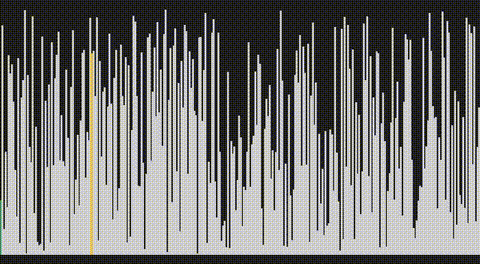

# Polpot Sort (ポルポトソート)

[](LICENSE)
[](https://www.python.org/)

[English README is here](https://github.com/heru0729/polpot-sort/blob/main/README.md)

ポルポトソートは、[スターリンソート](https://github.com/gustavo-depaula/stalin-sort)
から派生した、破壊的なジョークソートアルゴリズムです。ソート済みの出力を保証しません。
出力の要素数も保証しません。保証されるのは「生き残った要素はすべて、ランダムに選ばれた
基準値以下である」ということだけです。



## アルゴリズム

1. 入力配列からランダムに1要素を選び、それを**基準値**として固定する(実行中は一切更新しない)。
2. 配列を走査し、基準値より大きい要素はその場で除外する。基準値以下の要素は生存する。
3. フェーズ1を生き延びた要素それぞれに対し、値とは無関係に一定確率(デフォルト20%)で
   さらに除外する。

出力は入力の部分列であり、要素数は入力以下になります。ソートアルゴリズムとしては
完全に破綻していますが、それこそがこのアルゴリズムの狙いです。

## ファイル構成

| ファイル | 用途 |
|---|---|
| `polpot_sort.py` | アルゴリズム本体(`PolpotSort` クラス + CLIデモ / Python) |
| `javascript/polpot_sort.js` | アルゴリズム本体(`PolpotSort` クラス + CLIデモ / Node.js) |
| `make_video.py` | 粛清の過程を棒グラフ動画(mp4)として書き出す |
| `requirements.txt` | `make_video.py` に必要な依存パッケージ |
| `assets/demo.gif` | 上に表示しているサンプル出力 |
| `LICENSE` | MITライセンス |

## インストール

```bash
git clone https://github.com/<your-username>/polpot-sort.git
cd polpot-sort
```

`polpot_sort.py` はサードパーティ依存なしで動作します。`make_video.py` を使う場合は
`requirements.txt` の依存パッケージに加え、システムに `ffmpeg` が必要です。

```bash
pip install -r requirements.txt
```

## 使い方

### ライブラリとして使う

```python
from polpot_sort import PolpotSort

data = [5, 3, 8, 1, 9, 2, 7, 4, 6, 10]
sorter = PolpotSort(purge_probability=0.2, seed=42)
result = sorter.sort(data)
print(result)
```

### コマンドラインから使う

```bash
python polpot_sort.py --size 20 --low 1 --high 100 --seed 42
```

| 引数 | 説明 | デフォルト |
|---|---|---|
| `--size` | 生成するランダム要素数 | `10` |
| `--low` | 生成する値の下限 | `1` |
| `--high` | 生成する値の上限 | `100` |
| `--purge-probability` | フェーズ2での粛清確率 | `0.2` |
| `--seed` | 再現性のための乱数シード | `None` |

### JavaScript (Node.js) から使う

```bash
cd javascript
node polpot_sort.js --size 20 --low 1 --high 100 --seed 42
```

```javascript
const { PolpotSort } = require('./javascript/polpot_sort.js');

const data = [5, 3, 8, 1, 9, 2, 7, 4, 6, 10];
const sorter = new PolpotSort({ purgeProbability: 0.2, seed: 42 });
const result = sorter.sort(data);
console.log(result);
```

CLIオプションはPython版と同じ(`--size`, `--low`, `--high`,
`--purge-probability`, `--seed`)。依存パッケージなしで動作する。

### 可視化動画を生成する

```bash
python make_video.py
```

カレントディレクトリに `polpot_sort_pillow.mp4` が生成されます。色の意味は以下の通りです。

| 色 | 意味 |
|---|---|
| グレー | 未処理 |
| 緑 | 生存 |
| 黄 | 基準値 |

粛清された要素はその場で即座に消えます。動画の長さは入力サイズに応じて自動調整され、
要素数が多いほど再生速度が速くなります。

## 関連するジョークアルゴリズム

- [スターリンソート](https://github.com/gustavo-depaula/stalin-sort) — 昇順を乱す要素を
  片っ端から削除する。
- ボゴソート — ソートされるまでひたすらシャッフルを繰り返す。
- サノスソート — 1回の走査ごとに要素のちょうど半分をランダムに削除する。

## ライセンス

MIT — [LICENSE](LICENSE) を参照。
